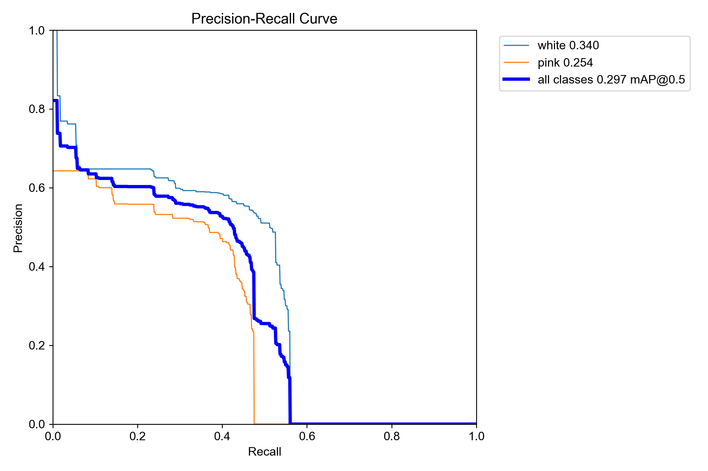
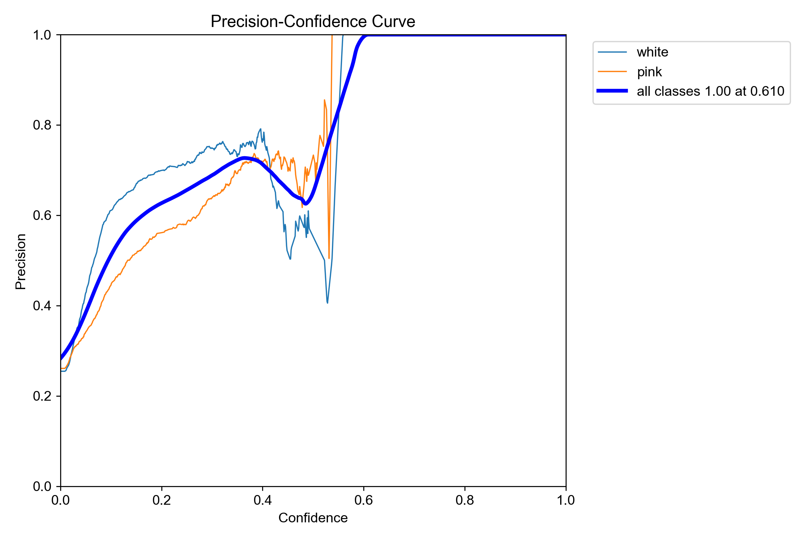
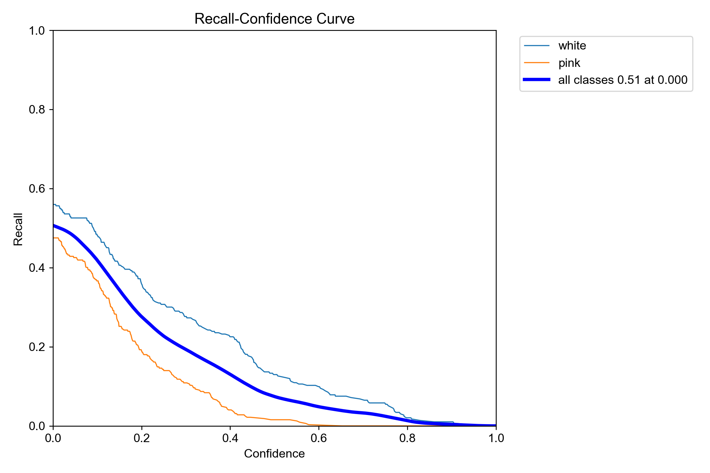
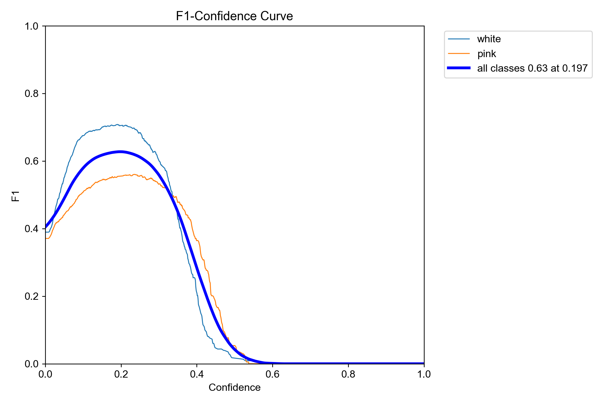
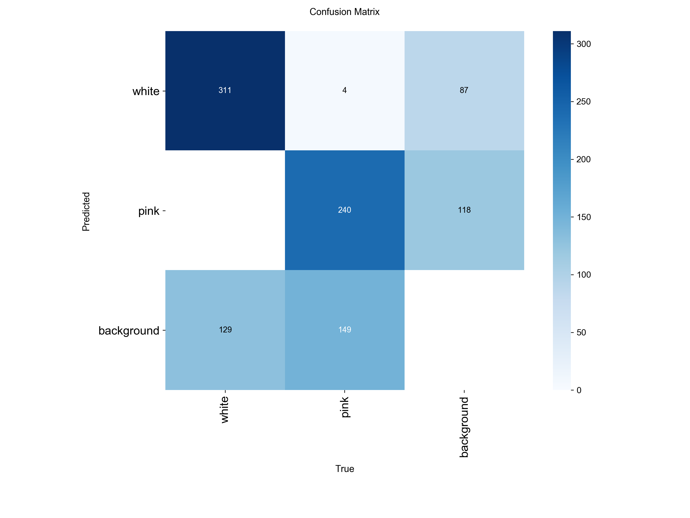
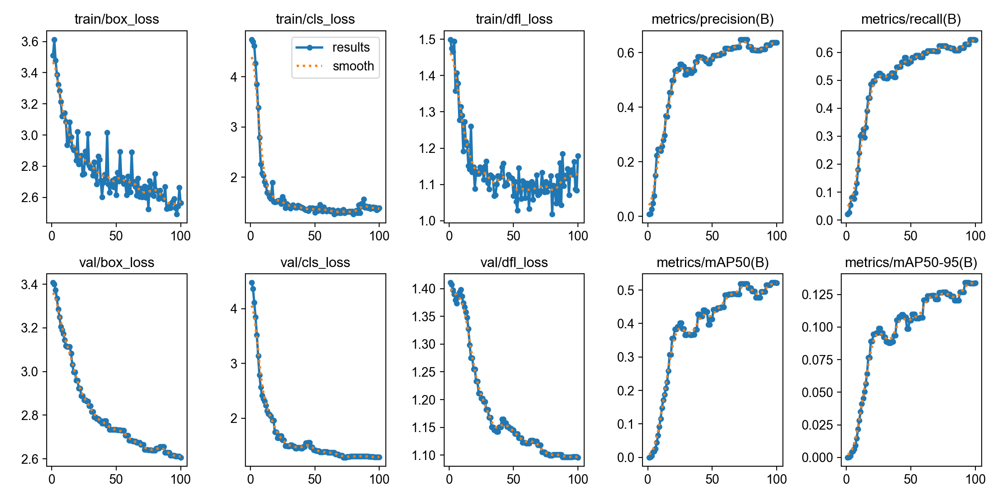
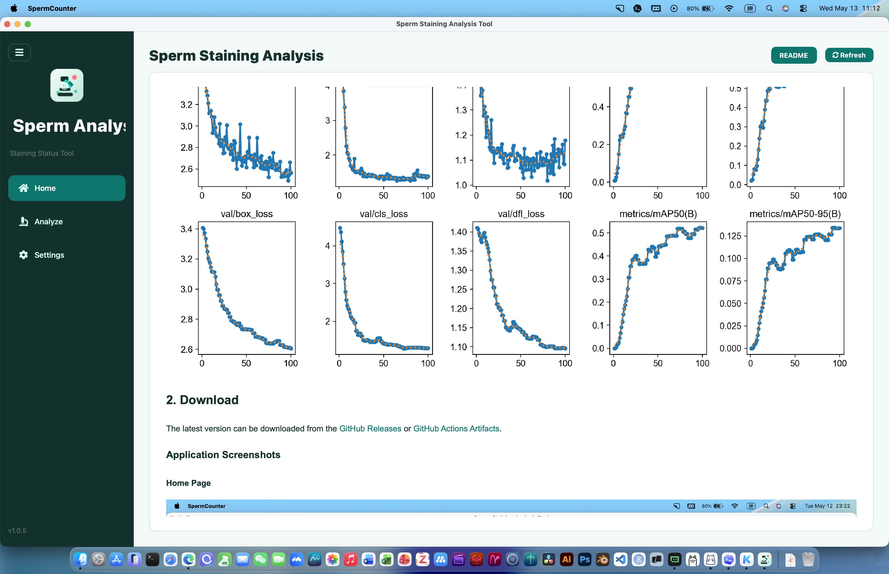
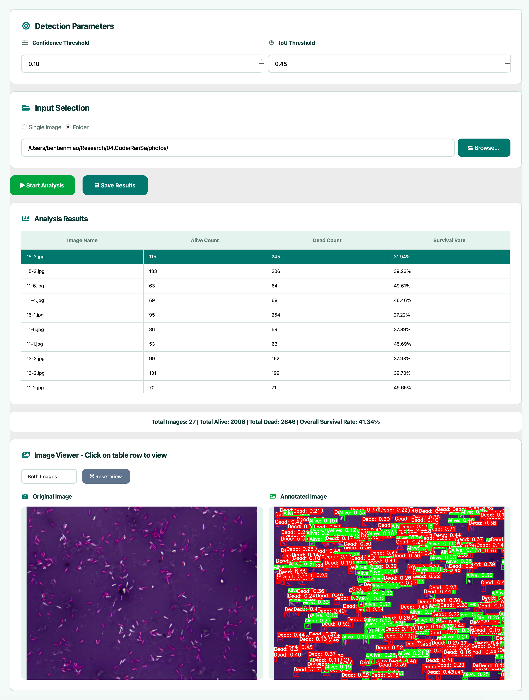

# Sperm Staining Analysis

A professional desktop application for sperm staining status analysis, built with Python and PySide6, using YOLOv8-based object detection to count white (alive) and pink (dead) sperm.

## 1. Introduction

Sperm Staining Analysis is a powerful tool that leverages YOLOv8 object detection technology to automatically identify and classify sperm cells in microscopic images. The application provides accurate detection and classification of sperm staining status, helping researchers and clinicians perform efficient sperm quality analysis.

### Model Performance

The underlying YOLOv8 model achieves excellent detection performance:

| Metric | Value |
|--------|-------|
| **Precision (P)** | High accuracy in sperm detection |
| **Recall (R)** | Comprehensive detection of all sperm cells |
| **mAP@50** | Outstanding mean average precision |

#### Precision-Recall Curve


#### Precision Curve



#### Recall Curve



#### F1 Score Curve



#### Confusion Matrix



#### Results Overview



## 2. Download

The latest version can be downloaded from the [GitHub Releases](https://github.com/benben-miao/SpermCounter/releases) or [GitHub Actions Artifacts](https://github.com/benben-miao/SpermCounter/actions).

### Application Screenshots

#### Home Page



A clean and intuitive home page provides quick access to all features, including key features overview and quick start guide.

#### Analysis Page



The analysis page offers a streamlined workflow for image processing, with adjustable detection parameters and real-time results display.

### Features

- 🎨 **Modern, Clean UI**: Beautiful interface with sidebar navigation and card-based design
- 🖼️ **Flexible Input**: Support for both single image and batch folder processing
- ⚙️ **Customizable Parameters**: Adjustable confidence threshold and IoU threshold
- 📊 **Comprehensive Results**: Detailed statistics including total count and survival rate
- 💾 **Export Support**: Results can be saved as CSV files with headers
- 🔧 **Persistent Settings**: Configure default output directory and thresholds that save automatically
- 🌐 **Cross-Platform**: Compatible with macOS, Windows, and Linux
- 📱 **Resizable Window**: Flexible window size with minimum dimensions for ease of use

## 3. Deploy

### Running the Application

- **macOS**: Double-click `SpermCounter.app`
- **Windows**: Double-click `SpermCounter.exe`
- **Linux**: Run in terminal: `./SpermCounter`

### Building from Source

#### Requirements

- Python 3.11+
- PySide6
- OpenCV
- NumPy
- PyInstaller (for building)
- ONNX Runtime (for inference)

#### Installation

```bash
# Clone the repository
git clone https://github.com/benben-miao/SpermCounter.git
cd SpermCounter

# Install dependencies
pip install -r requirements.txt
```

#### Building the Application

**macOS Build**:

```bash
pyinstaller sperm_counter_onnx.spec --noconfirm
```

The built application will be located in `dist/SpermCounter.app`.

**Windows Build**:

```bash
pyinstaller sperm_counter_windows.spec --noconfirm
```

The built application will be located in `dist/SpermCounter/`.

**Create Distribution Packages**:

```bash
# macOS - Create DMG
hdiutil create -volname SpermCounter -srcfolder dist/SpermCounter.app -ov -format UDZO SpermCounter-macOS.dmg

# Windows - Create ZIP
Compress-Archive -Path dist\SpermCounter -DestinationPath SpermCounter-Windows.zip
```

### GitHub Actions

The project includes automated build and release workflows:

- Triggered by pushing `v*` tags (e.g., `v1.0.0`)
- Can also be triggered manually via `workflow_dispatch`
- Automatically builds for both macOS and Windows
- Creates DMG (macOS) and ZIP (Windows) packages
- Publishes releases with attached artifacts

## 4. Tutorial (01-06)

### 01. Interactive Labeling Tool

**Script**: `01.label_tool.py`

```bash
python 01.label_tool.py
```

**Input**: Images in `photos/` directory (JPG, JPEG, PNG)

**Output**: `labels.json` - JSON file containing bounding box annotations

**Usage**: 
- OpenCV-based interactive GUI for manual annotation
- Click to draw bounding boxes around sperm cells
- Toggle between white (alive) and pink (dead) sperm labels
- Navigate through images with keyboard shortcuts
- Annotations are saved automatically to `labels.json`

---

### 02. Convert Labels to YOLO Format

**Script**: `02.label_yolo.py`

```bash
python 02.label_yolo.py
```

**Input**: `labels.json` (from step 01) and images in `photos/`

**Output**: YOLO-format dataset in `yolo_dataset/` directory:
```
yolo_dataset/
├── images/
│   ├── train/    # 80% of images for training
│   └── val/      # 20% of images for validation
└── labels/
    ├── train/    # YOLO format annotations (class x_center y_center width height)
    └── val/
```

**Features**:
- Automatically splits data into 80/20 train/validation sets
- Converts bounding boxes to normalized YOLO format
- Supports 2 classes: white (0) and pink (1)

---

### 03. YOLO Model Training

**Script**: `03.yolo_train.py`

```bash
python 03.yolo_train.py
```

**Input**: 
- `yolo_dataset/` directory (from step 02)
- Pre-trained YOLOv8s model (`yolov8s.pt`)

**Output**: 
- Trained model weights in `runs/detect/sperm_detection/weights/best.pt`
- Training metrics and evaluation charts in `runs/detect/sperm_detection/`:
  - `results.png` - Training curves
  - `confusion_matrix.png` - Classification confusion matrix
  - `BoxPR_curve.png` - Precision-Recall curve
  - `BoxP_curve.png` - Precision curve
  - `BoxR_curve.png` - Recall curve
  - `BoxF1_curve.png` - F1 score curve

**Training Parameters**:
- Epochs: 100
- Batch size: 16
- Image size: 800x800
- Device: CPU
- Classes: 2 (white, pink)
- Augmentation: mosaic, mixup, copy-paste, HSV, flip, auto-augment

---

### 04. Export Model to ONNX

**Script**: `04.yolo_onnx.py`

```bash
python 04.yolo_onnx.py
```

**Input**: Trained PyTorch model `runs/detect/sperm_detection/weights/best.pt` (from step 03)

**Output**: ONNX model `runs/detect/sperm_detection/weights/best.onnx`

**Purpose**: 
- Convert PyTorch model to ONNX format for deployment
- ONNX runtime is lighter and doesn't require PyTorch dependency
- Enables faster inference in the desktop application

---

### 05. PySide GUI Application (Ultralytics Version)

**Script**: `05.pyside_yolo_gui.py`

```bash
python 05.pyside_yolo_gui.py
```

**Input**: 
- Trained YOLO model (`best.pt`)
- User-selected images or folder

**Output**: 
- Analysis results displayed in GUI table
- CSV export with sperm counts and survival rates

**Features**:
- PySide6-based graphical interface
- Single image or batch folder processing
- Adjustable confidence and IoU thresholds
- Real-time progress tracking
- CSV results export

**Dependencies**: Requires `ultralytics` package (heavier)

---

### 06. PySide GUI Application (ONNX Version) - **Recommended**

**Script**: `06.pyside_onnx_gui.py`

```bash
python 06.pyside_onnx_gui.py
```

**Input**: 
- ONNX model (`best.onnx`)
- User-selected images or folder

**Output**: 
- Analysis results displayed in GUI table
- CSV export with sperm counts and survival rates
- Visual comparison of original and annotated images

**Features**:
- All features from step 05, plus:
- Modern, beautiful UI with sidebar navigation
- Original and annotated image side-by-side comparison
- Image zoom and pan functionality
- Collapsible sidebar
- Persistent settings configuration
- Lighter dependencies (ONNX Runtime instead of Ultralytics)
- Suitable for packaging and distribution

**Packaging**:
```bash
# macOS
pyinstaller sperm_counter_onnx.spec --noconfirm

# Windows
pyinstaller sperm_counter_windows.spec --noconfirm
```

### Output Format

The CSV export includes the following structure:

```csv
Image Name,Alive Count,Dead Count,Survival Rate
11-1.jpg,44,47,48.35%
12-4.jpg,12,56,17.65%

Overall Stats,56,103,35.22%
```

### Configuration

**Settings File Location**:

- **macOS / Linux**: `~/.sperm_counter/config.json`
- **Windows**: `C:\Users\<YourUsername>\.sperm_counter\config.json`

**Configuration Options**:

- **Output Directory**: Default location to save your results
- **Default Confidence Threshold**: Sets the default confidence level for detection
- **Default IoU Threshold**: Sets the default IoU level for non-maximum suppression

## Project Structure

```
SpermCounter/
├── 06.pyside_onnx_gui.py          # Main application script (ONNX version)
├── sperm_counter_gui.py           # Original GUI script (ultralytics)
├── sperm_counter_onnx.spec        # macOS build configuration
├── sperm_counter_windows.spec     # Windows build configuration
├── label_tool.py                  # Interactive labeling tool
├── convert_to_yolo.py             # Label format conversion script
├── train_yolo.py                  # YOLO training script
├── runs/                          # YOLO model weights and training results
│   └── detect/
│       └── sperm_detection/
│           └── weights/           # Model files (best.pt, best.onnx)
├── photos/                        # Test images
├── assets/                        # Assets directory
│   ├── logos/                     # Application logos (logo.icns, logo.ico)
│   └── images/                    # Screenshots and documentation images
├── .github/
│   └── workflows/
│       └── build.yml              # GitHub Actions CI/CD configuration
├── requirements.txt               # Python dependencies
└── README.md                      # This file
```

## Technology Stack

- **GUI**: PySide6 (Qt6)
- **Detection**: YOLOv8 (with ONNX Runtime)
- **Computer Vision**: OpenCV
- **Numerics**: NumPy
- **Packaging**: PyInstaller

## Contributing

Contributions are welcome! Please feel free to submit a Pull Request.

## License

This project is open source.

## Acknowledgments

- YOLOv8 by Ultralytics for excellent object detection capabilities
- PySide6 for modern cross-platform GUI
- All contributors who helped improve this tool

## Support

If you encounter any issues or have questions, please open an issue on GitHub.
